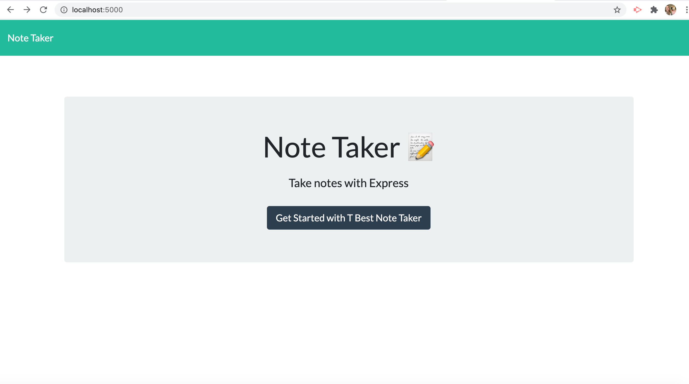
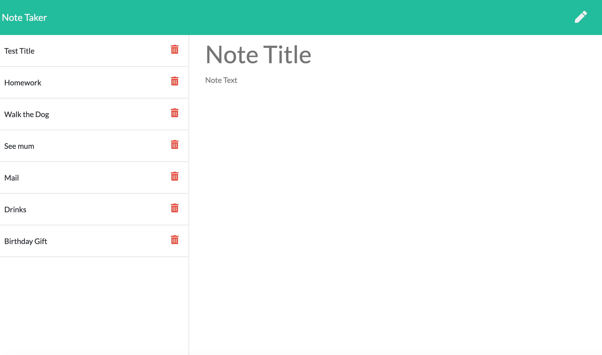
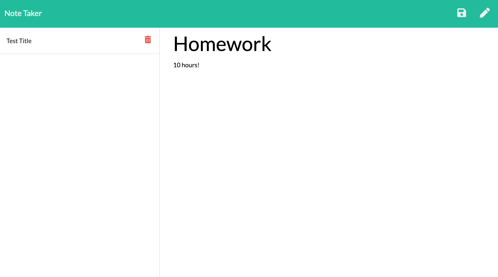

# Note-Taker
## Index:
- What
- Why
- How
- Techology used
- Images
- Links
## What:
This is an application that can be used to write, save and delete notes.
## Why:
Easy to use and helps the user keep track of important notes, remove items no longer needed and ultimately keep the user very well organized. All of the information the user would want is available when needed.
## How:
Information is retreived from a JSON file. HTML and API routes were created to attain data.
## Technologies used:
This application is deployed on Heroku. Express backend was used to save and retrieve data. HTML and css were used for the front end.
## Images:
This is the entry in to T Best Note Taker application

Once in the application, the user can enter in as many notes as they like. The user clicks save on the upper right corner of the screen and the notes are rendered to the left side of the screen.

A trash bin will be beside each of the notes, so when the user clicks the trash bin, the note will be deleted. However, if the user wants to view an already saved note, they can do so by pressing any one of the aved notes from the list. The description will appear on the main page.

 

## Links:
[Link to deployed website:](https://teresaheidt.github.io/T-Best-Note-Taker/)

[Link to Heroku application:](https://tbestnotetaker.herokuapp.com/)

